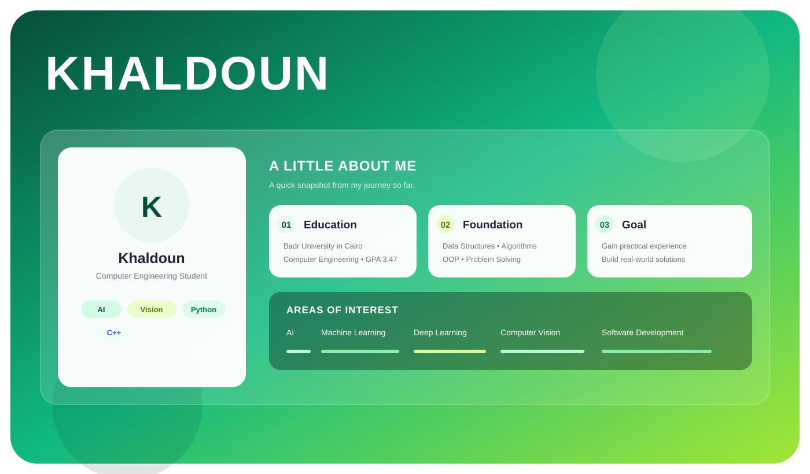

<div align="center">



</div>

<a href="https://www.linkedin.com/in/khaldoun-alkhatib/">

</a>

<a href="mailto:khaldounmouhamad20@gmail.com">

</a>

<br><br>


</div>

---

<div align="center">

## 👋 About Me

</div>

I'm **Khaldoun**, a second-year **Computer Engineering student at Badr University in Cairo (BUC)** with a strong foundation in programming, data structures, algorithms, and problem-solving.

I'm particularly interested in **Artificial Intelligence, Machine Learning, Deep Learning, Computer Vision, and emerging technologies**.

I enjoy learning by building, experimenting with new technologies, and continuously improving my technical skills.

---

<div align="center">

## 🧠 Core Skills

<br>


<br><br>


<br><br>


</div>

---

<div align="center">

## 🛠️ Tools & Technologies


<br><br>


</div>

---

<div align="center">

## 🎓 Education

**Badr University in Cairo (BUC)**
Bachelor of Computer Engineering

**Current Academic Year:** Second Year
**GPA:** 3.47 / 4.00
**Expected Graduation:** 2028

</div>

---

<div align="center">

## 📜 Certifications


</div>

---

<div align="center">

## 🎯 What I'm Working Toward

<br>

```text
Learn
  ↓
Build
  ↓
Gain Experience
  ↓
Solve Real Problems
  ↓
Keep Growing
```

I'm currently looking for opportunities where I can apply my academic knowledge,
develop practical skills, and contribute to real-world technical work.

</div>

---

<div align="center">

## 📊 GitHub

<br>


<br><br>


</div>

---

<div align="center">

## 🌐 Connect With Me

<br>

<a href="https://github.com/Tiledcoper">

</a>

<a href="https://www.linkedin.com/in/khaldoun-alkhatib/">

</a>

<a href="mailto:khaldounmouhamad20@gmail.com">

</a>

<br><br>

### `Thanks for stopping by 🚀`

</div>
